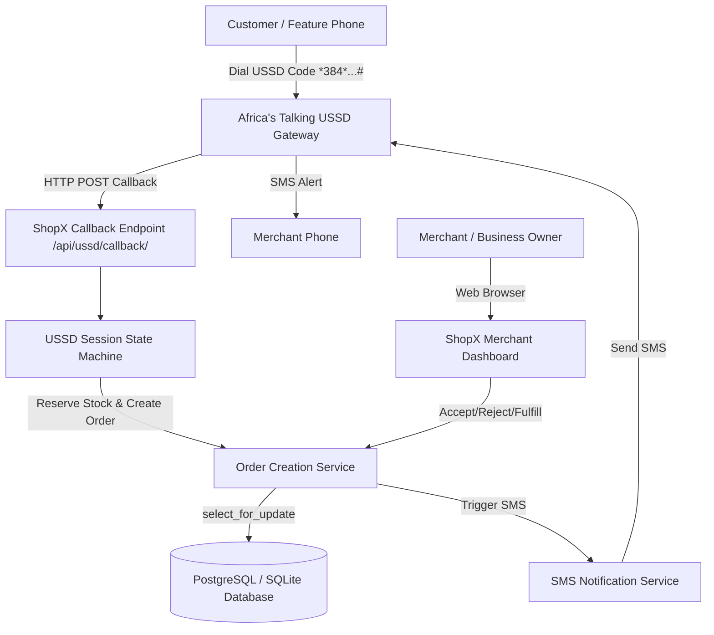

# ShopX - Telecom-Powered Local Commerce Platform

> **Tagline:** *"Local commerce, connected."*

ShopX is a telecom-powered local commerce platform designed to bridge the digital commerce gap for local merchants and customers. It enables customers to discover local businesses, browse products, check real-time inventory availability, and place **Pay on Delivery** orders directly over **USSD** (without requiring smartphones, mobile data, or internet connectivity).

Business owners manage their storefronts, products, stock reservations, and incoming customer orders via a modern, responsive web dashboard built with Django Templates and Tailwind CSS. SMS notifications are delivered via **Africa's Talking**.

---

## Key Features

- **USSD Commerce Access**: Instant product discovery, browsing, quantity selection, address entry, and checkout over feature phones via Africa's Talking USSD protocol.
- **Atomic Inventory Reservations**: Database row-level locking (`select_for_update()`) prevents race conditions, overselling, and negative inventory stock.
- **Reservation Expiration Handling**: Sweeps expired pending reservations and automatically releases stock back to available inventory.
- **Merchant Web Dashboard**: Responsive dashboard for local business owners to manage products, adjust inventory, confirm/reject orders, and track fulfillment status.
- **Strict Business Data Isolation**: Ensures merchants can only view and manage data belonging to their own business.
- **Price & Name Snapshotting**: Snapshots product name and unit price at order creation time to protect historical order integrity.
- **SMS Notifications Abstraction**: Provider adapter for Africa's Talking SMS API with logging fallbacks, ensuring order placement succeeds even if SMS gateways temporarily fail.
- **REST API**: Django REST Framework endpoints for mobile apps or external integrations.
- **Docker Ready**: Multi-container setup with Docker Compose and PostgreSQL support.

---

## How ShopX Works



### Order Workflow Lifecycle

```text
PENDING (Customer placed order via USSD)
   │
   ├─► BUSINESS_CONFIRMED (Merchant accepted order)
   │      │
   │      └─► PREPARING ─► READY_FOR_DELIVERY ─► OUT_FOR_DELIVERY ─► DELIVERED (Payment marked PAID & Stock committed)
   │
   ├─► REJECTED (Merchant declined ─ Reserved stock released)
   │
   └─► CANCELLED (Reservation expired or customer cancelled ─ Reserved stock released)
```

---

## Tech Stack

- **Backend**: Python 3.12+, Django 5.x / 6.x, Django REST Framework, `psycopg`, `python-dotenv`
- **Database**: PostgreSQL (Production) / SQLite (Local Dev)
- **Frontend**: Django Templates, Tailwind CSS (CDN), Vanilla JavaScript
- **Telecommunications**: Africa's Talking USSD Gateway & SMS API
- **Containerization**: Docker, Docker Compose

---

## Project Structure

```text
ShopX/
│
├── config/                 # Project configuration (settings, urls, wsgi, asgi)
├── accounts/               # Custom User model, roles (ADMIN, BUSINESS_OWNER, BUSINESS_STAFF), auth views
├── businesses/             # Business profiles, dashboard views, seed management command
├── catalog/                # Categories and Products
├── inventory/              # Inventory stock, atomic reservation services, stock adjust forms
├── customers/              # Customer profiles and Address models
├── orders/                 # Orders, OrderItems, order state transition services, expiration command
├── ussd/                   # Africa's Talking USSD callback view & Session State Machine
├── notifications/          # SMS abstraction & Africa's Talking service adapter
├── delivery/               # Delivery lifecycle service abstraction
├── common/                 # Base models, phone normalizer, order generator, domain exceptions
├── api/                    # REST API ViewSets & Serializers
│
├── templates/              # Dashboard & Auth HTML templates (Tailwind CSS)
├── static/                 # Static assets
├── tests/                  # Automated test suite
│
├── manage.py
├── requirements.txt
├── .env.example
├── .gitignore
├── Dockerfile
├── docker-compose.yml
└── README.md
```

---

## Getting Started

### Prerequisites

- Python 3.12+
- Docker & Docker Compose (Optional for containerized run)

### Installation & Local Setup

1. **Clone the repository**:
   ```bash
   git clone https://github.com/your-org/ShopX.git
   cd ShopX
   ```

2. **Create and activate a virtual environment**:
   ```bash
   python -m venv venv
   # On Windows:
   .\venv\Scripts\activate
   # On macOS/Linux:
   source venv/bin/activate
   ```

3. **Install dependencies**:
   ```bash
   pip install -r requirements.txt
   ```

4. **Environment Variables**:
   Copy `.env.example` to `.env`:
   ```bash
   cp .env.example .env
   ```
   *(By default, leaving `DATABASE_URL` empty defaults to local SQLite development).*

5. **Run Migrations**:
   ```bash
   python manage.py makemigrations
   python manage.py migrate
   ```

6. **Seed Demo Data**:
   Seed realistic demo businesses, categories, products, stock, and demo user accounts:
   ```bash
   python manage.py seed_demo
   ```
   *Demo Merchant Accounts Created:*
   - **Admin**: `admin` / `Password123!`
   - **ABC Electronics**: `abc_owner` / `Password123!`
   - **Kano Fashion Hub**: `kano_owner` / `Password123!`
   - **Northern Foods**: `northern_owner` / `Password123!`

7. **Run Development Server**:
   ```bash
   python manage.py runserver 0.0.0.0:8000
   ```
   Access the dashboard at `http://127.0.0.1:8000/dashboard/`.

---

## Running Automated Tests

Run the full Django unit & integration test suite:
```bash
python manage.py test
```
The test suite covers:
- User roles & business data isolation
- Inventory stock reservations & concurrency checks
- Price snapshotting on order items
- Full USSD session state machine flows (CON/END formatted output)
- Expiry cleanup management command
- SMS notification resilience

---

## Management Commands

### Seed Demo Data
```bash
python manage.py seed_demo
```

### Release Expired Inventory Reservations
Sweeps pending orders past their expiration time, cancels them, and returns reserved stock back to available inventory:
```bash
python manage.py release_expired_reservations
```

---

## Telecommunications Integration (Africa's Talking)

### USSD Callback Configuration
1. Register/Login to [Africa's Talking Sandbox](https://account.africastalking.com/).
2. Create a USSD Channel (e.g. `*384*123#`).
3. Set the callback URL to your publicly accessible ShopX URL (e.g., using ngrok):
   `https://your-domain.ngrok-free.app/api/ussd/callback/`
4. Requests from Africa's Talking will send `sessionId`, `serviceCode`, `phoneNumber`, and `text` parameters.

### SMS Configuration
Add your Africa's Talking API credentials to `.env`:
```env
AFRICASTALKING_USERNAME=sandbox
AFRICASTALKING_API_KEY=your_actual_api_key
AFRICASTALKING_SENDER_ID=ShopX
```
*If credentials are omitted, ShopX automatically uses a safe Mock SMS provider that logs outgoing messages without interrupting commerce operations.*

---

## Docker Setup

To run ShopX with PostgreSQL in Docker Compose:

```bash
docker compose up --build
```
This starts:
- **PostgreSQL 16** container (`db`) on port `5432` with healthcheck.
- **ShopX Web App** container (`web`) on port `8000`.

---

## REST API Summary

- `GET /api/businesses/` - List active businesses
- `GET /api/categories/` - List active categories
- `GET /api/products/` - List active products (Business scoped when authenticated)
- `GET /api/inventory/` - Merchant inventory status
- `GET /api/orders/` - List merchant orders
- `POST /api/orders/<id>/accept/` - Accept pending order
- `POST /api/orders/<id>/reject/` - Reject pending order
- `POST /api/orders/<id>/update_status/` - Advance order fulfillment status
- `POST /api/ussd/callback/` - Africa's Talking USSD Gateway callback

---

## Scope & Future Enhancements

### Out of Scope for Core MVP
- Online payment gateway (Paystack/Flutterwave) — MVP uses Pay on Delivery.
- Mobile apps (React Native/Flutter) — Core MVP is USSD + Web Dashboard.
- Celery / Redis worker queues — Expiry cleanup is handled via lightweight management command.

---

## License & Credits

Built for telecommunications hackathons powering inclusive local commerce.
Designed with Django, DRF, Tailwind CSS, and Africa's Talking.
